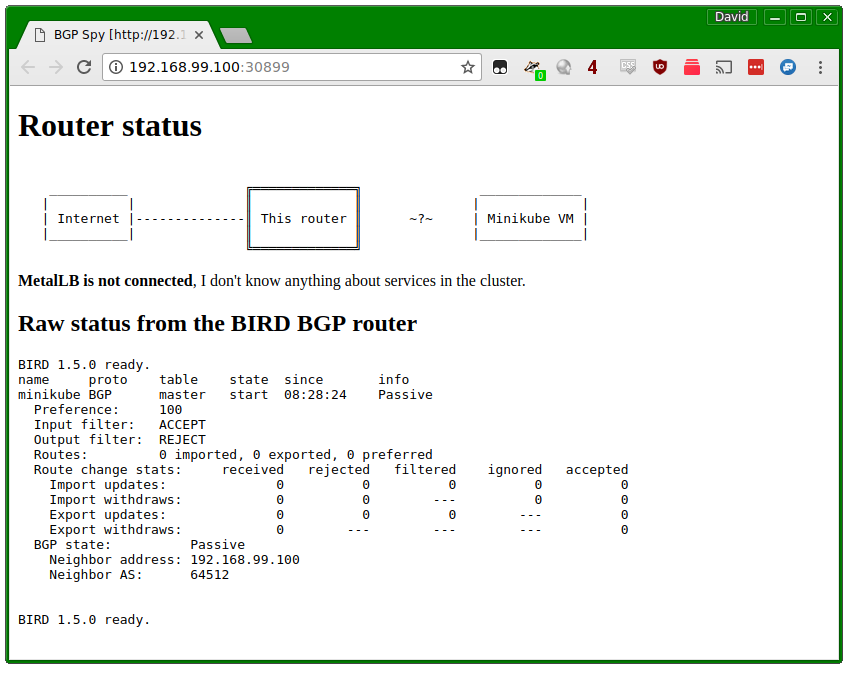
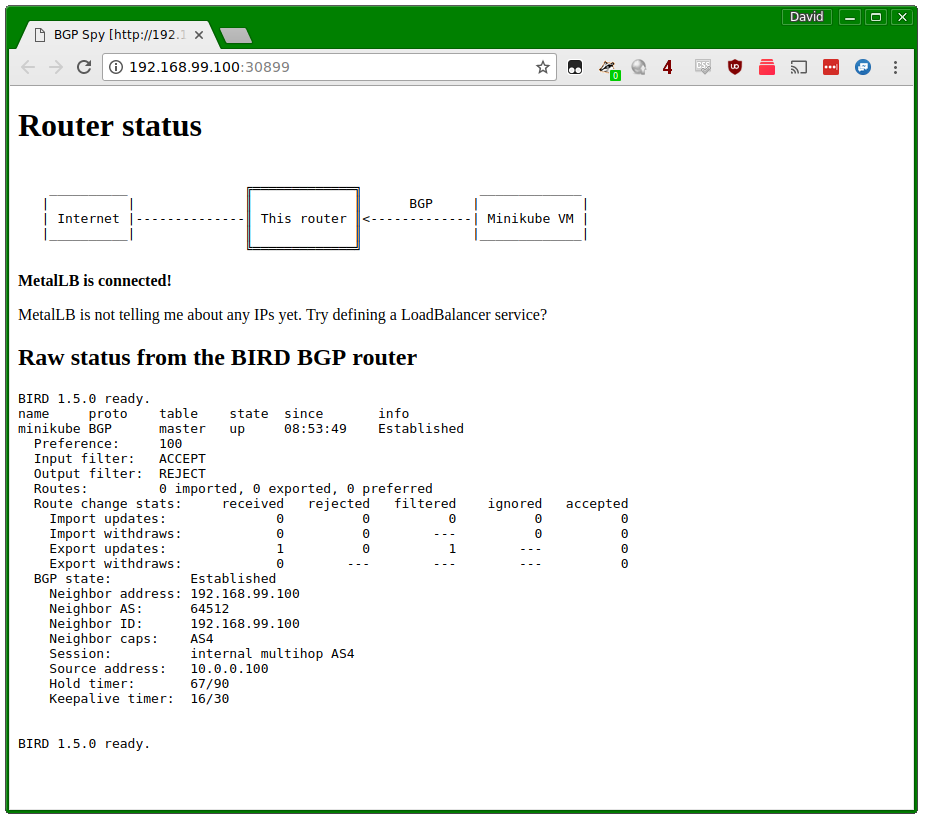

# Tutorial

In this tutorial, we'll set up a BGP router in Minikube, configure
MetalLB to use it, and create some load-balanced services. We'll be
able to inspect the BGP router's state, and see that it reflects the
intent that we expressed in Kubernetes.

Because this will be a simulated environment inside Minikube, this
setup only lets you inspect the router's state and see what it _would_
do in a real deployment. Once you've experimented in this setting and
are ready to set up MetalLB on a real cluster, refer to
the [installation guide]() for instructions.

Here is the outline of what we're going to do:
1. Set up a Minikube cluster,
2. Set up a mock BGP router that we can inspect in subsequent steps,
3. Install MetalLB on the cluster,
4. Configure MetalLB to peer with our mock BGP router, and give it some IP addresses to manage,
5. Create a load-balanced service, and observe how MetalLB sets it up,
6. Tweak MetalLB's configuration, to see how the cluster reacts.

# Set up a Minikube cluster

If you don't already have a Minikube cluster set up, follow
the
[instructions](https://kubernetes.io/docs/getting-started-guides/minikube/) on
kubernetes.io to install Minikube and get your playground cluster
running. Once you've done so, you should be able to run `minikube
status` and get output that looks something like this:

```
minikube: Running
cluster: Running
kubectl: Correctly Configured: pointing to minikube-vm at 192.168.99.100
```

# Set up a mock BGP router

MetalLB exposes load-balanced services using the BGP routing protocol,
so we need a BGP router to talk to. In a production cluster, this
would be set up as a dedicated hardware router (e.g. an Ubiquiti
EdgeRouter), or a soft router using open-source software (e.g. a Linux
machine running the [BIRD](http://bird.network.cz) routing suite).

For this tutorial, we'll deploy a pod inside minikube that runs
BIRD. It will be configured to speak BGP, but it won't configure Linux
to forward traffic based on the data it receives. Instead, we'll just
inspect that data to see what a real router _would_ do.

Deploy this mock router with `kubectl`:

`kubectl apply -f manifests/tutorial-1.yaml`

This will create a deployment for our BGP router, as well as two
cluster-internal services. Wait for the router pod to start, by running `kubectl get pods` until you see the bgp-router pod in the `Running` state:

```
NAME                         READY     STATUS    RESTARTS   AGE
bgp-router-bccb997b6-dvcj6   1/1       Running   0          2m
```

(your pod will have a slightly different name, because the suffix is
randomly generated by the deployment – this is fine.)

In addition to the router pod, the `tutorial-1.yaml` manifest created
two cluster-internal services. The `bgp-router` service will expose
our BGP router at `10.0.0.100`, so that we have a stable IP address
for MetalLB to talk to. The `bgp-spy` service is a little UI that
shows us what the router is thinking.

Let's open that UI now. Run: `minikube service bgp-spy`. This will
open a new browser tab that should look something like this:



If you're comfortable with BGP and networking, the raw BIRD status may
be interesting. If you're not, don't worry, the important part is
above: our router is running, but knows nothing about our Kubernetes
cluster, because MetalLB is not connected.

Obviously, MetalLB isn't connected to our router, it's not installed
yet! Let's address that. Keep the bgp-spy tab open, we'll come back to
it shortly.

# Install MetalLB

MetalLB runs in two parts: a cluster-wide controller, and a
per-machine BGP speaker. Since Minikube is a Kubernetes cluster with a
single VM, we'll end up with the controller and one BGP speaker.

Install MetalLB by applying the manifest:

`kubectl apply -f manifests/metallb.yaml`

This manifest creates a bunch of resources. Most of them are related
to access control, so that MetalLB can read and write the Kubernetes
objects it needs to do its job.

Ignore those bits for now, the two pieces of interest are the
"controller" deployment, and the "bgp-speaker" daemonset. Wait for
these to start by monitoring `kubectl get pods -n
metallb-system`. Eventually, you should see two running pods (again,
the pod name suffixes will be different on your cluster).

```
NAME                          READY     STATUS    RESTARTS   AGE
bgp-speaker-flxtr             1/1       Running   0          33s
controller-74dddf4794-zq69z   1/1       Running   0          33s
```

Refresh the bgp-spy tab from earlier, and... It's the same! MetalLB is
still not connected, and our router still knows nothing about cluster
services.

That's because the MetalLB installation manifest doesn't come with a
configuration, so both the controller and BGP speaker are sitting
idle, waiting to be told what they should do. Let's fix that!

# Configure MetalLB

We have a sample MetalLB configuration in
`manifests/tutorial-2.yaml`. Let's take a look at it before applying
it:

```yaml
apiVersion: v1
kind: ConfigMap
metadata:
  namespace: metallb-system
  name: metallb-config
data:
  config: |
    peers:
    - my-asn: 64512
      peer-asn: 64512
      peer-address: 10.0.0.100
    address-pools:
    - name: my-ip-space
      cidr:
      - 198.51.100.0/24
      advertisements:
      - localpref: 100
```

MetalLB's configuration is a standard Kubernetes ConfigMap,
`metallb-config` under the `metallb-system` namespace. It contains two
pieces of information: who MetalLB should talk to, and what IP
addresses it's allowed to hand out.

In this configuration, we're setting up a BGP peering with
`10.0.0.100`, which is the IP address of the `bgp-router` service we
created in step 2. And we're giving MetalLB 256 IP addresses to use,
from 198.51.100.0 to 198.51.100.255. The final section gives MetalLB
some BGP attributes that it should use when announcing IP addresses to
our router.

Apply this configuration now:

`kubectl apply -f manifests/tutorial-2.yaml`

The configuration should take effect within a few seconds. Refresh the
bgp-spy browser page again (run `minikube service bgp-spy` if you
closed it and need to get it back). If all went well, you should see a
much happier router:


